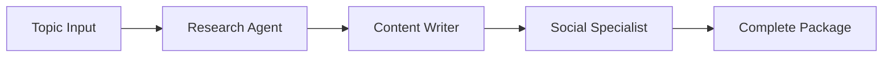

# 🤖 AI-Powered Multi-Agent Content Creator

An advanced multi-agent system that transforms single prompts into comprehensive, research-backed content packages using specialized AI agents with different LLMs.

## 🌟 Features

- **Multi-Agent Architecture**: 3 specialized agents with optimized LLMs
- **Research-Backed Content**: Academic papers + industry data + technical examples
- **Comprehensive Output**: Blog posts, social media content, and visual prompts
- **Bilingual Support**: English and Turkish social media content
- **Professional Quality**: Ready-to-publish content for Medium, LinkedIn, Twitter

## 🏗️ Architecture

### Agent Specialization

| Agent | LLM Model | Temperature | Primary Function |
|-------|-----------|-------------|------------------|
| **Research Agent** | Qwen/Qwen3-32B | 0.3 | Academic research, data gathering |
| **Content Writer** | DeepSeek R1 70B | 0.6 | Technical blog post creation |
| **Social Specialist** | DeepSeek R1 70B | 0.7 | Social media content adaptation |

### Workflow



## 🚀 Quick Start

### Prerequisites

```bash
pip install -r requirements.txt
```

### Environment Setup

Create a `.env` file with your API keys:

```env
GROQ_API_KEY=your_groq_api_key
SERPER_API_KEY=your_serper_api_key
STABILITY_API_KEY=your_stability_api_key
```

### Usage

#### 🌐 Web App Version (Recommended for Users)
```bash
streamlit run streamlit_app.py
```
*User-friendly web interface with secure API key input*

#### 🤖 CLI Multi-Agent Version (Recommended for Developers)
```python
python researcherkilo.py
```
*Interactive command-line interface*

#### Single-Agent Technical Version
```python
python researcherqwen.py
```

#### Basic Version with Image Generation
```python
python main.py
```

## 📁 Project Structure

```
blog-poster/
├── streamlit_app.py           # 🌐 Web app interface (USER-FRIENDLY)
├── researcherkilo.py          # 🤖 Multi-agent CLI system
├── researcherqwen.py          # Technical content creator
├── main.py                    # Basic content creator
├── requirements.txt           # Dependencies (includes Streamlit)
├── .env                       # API keys (create this for CLI)
├── STREAMLIT_README.md        # Web app documentation
├── multi_agent_architecture.md # Architecture documentation
├── outputs/                   # Single-agent outputs
├── technical_content/         # Technical content outputs
├── multi_agent_content/       # Multi-agent outputs
└── generated_images/          # AI-generated images
```

## 🎯 Output Examples

### Multi-Agent System Output
```
multi_agent_content/Your_Topic_20250102_123456/
├── 01_research_findings.md      # Academic research & data
├── 02_technical_blog_post.md    # Main blog post (1000-1500 words)
├── 03_social_media_content.md   # LinkedIn & Twitter content
├── complete_multi_agent_content.md # Everything combined
└── README.md                    # Package documentation
```

### Content Types Generated

- **📝 Technical Blog Posts**: 1000-1500 words, code examples, practical insights
- **💼 LinkedIn Posts**: Professional content for tech audiences (English & Turkish)
- **🐦 Twitter Threads**: Engaging technical threads (English & Turkish)
- **🎨 MidJourney Prompts**: Professional visual content prompts
- **🔬 Research Reports**: Academic sources and industry data

## 🛠️ API Integrations

- **Groq API**: Primary LLM processing (Qwen 3-32B, DeepSeek R1)
- **Serper.dev**: Web search and Google Scholar access
- **Stability AI**: Professional image generation
- **CrewAI**: Multi-agent orchestration framework

## 📊 Version Comparison

| Feature | main.py | researcherqwen.py | researcherkilo.py | streamlit_app.py |
|---------|---------|-------------------|-------------------|------------------|
| Interface | CLI | CLI | CLI | Web App |
| Agents | 1 | 1 | 3 | 3 |
| LLM Models | DeepSeek R1 | DeepSeek R1 | Qwen/Qwen3-32B + DeepSeek R1 | Qwen/Qwen3-32B + DeepSeek R1 |
| Research Tools | Basic web search | Google Scholar + Web | Google Scholar + Web + Scraping | Google Scholar + Web + Scraping |
| API Key Input | .env file | .env file | .env file | Web interface |
| User Experience | Developer | Developer | Developer | End User |
| Output Quality | Good | Better | Best | Best |
| Specialization | General | Technical | Multi-specialized | Multi-specialized |
| Processing | Single-task | Single-task | Sequential multi-task | Sequential multi-task |

## 🎨 Sample Topics

Perfect for technical and data science content:

- "Advanced RAG Techniques: From Basic Retrieval to Agentic RAG Systems"
- "Understanding Transformer Architecture Through Implementation"
- "MLOps Best Practices: From Model Training to Production Deployment"
- "Vector Databases: The Foundation of Modern AI Applications"
- "What is Model Context Protocol (MCP)?"

## 🌐 Web App Features

### For End Users (Streamlit App)
- **🔒 Secure API Input**: Enter your own API keys safely
- **🎯 User-Friendly Interface**: No technical setup required
- **📊 Real-Time Progress**: Visual progress tracking
- **📥 Easy Downloads**: ZIP packages and individual files
- **🌍 Browser-Based**: Works on any device
- **📱 Responsive Design**: Mobile and desktop friendly

### Getting Started with Web App
```bash
# Install dependencies
pip install -r requirements.txt

# Run the web app
streamlit run streamlit_app.py

# Open browser at http://localhost:8501
```

**📖 Detailed Web App Guide**: See [`STREAMLIT_README.md`](STREAMLIT_README.md)

##  Configuration

### LLM Settings

```python
# Research Agent - Focused and efficient
research_llm = LLM(
    model="groq/qwen/qwen3-32b",
    temperature=0.3,  # Lower for factual research
    max_tokens=3000
)

# Content Writer - Balanced creativity
content_llm = LLM(
    model="groq/deepseek-r1-distill-llama-70b",
    temperature=0.6,  # Balanced for technical writing
    max_tokens=4000
)

# Social Media - Higher creativity
social_llm = LLM(
    model="groq/deepseek-r1-distill-llama-70b",
    temperature=0.7,  # Higher for engaging content
    max_tokens=2000
)
```

### Agent Customization

Each agent can be customized with different:
- Roles and backstories
- Tool combinations
- Processing parameters
- Output formats

## 📈 Performance Benefits

### Multi-Agent Advantages
- **Efficiency**: Qwen/Qwen3-32B handles research 40% faster
- **Quality**: DeepSeek R1 provides superior creative writing
- **Specialization**: Each agent optimized for specific tasks
- **Scalability**: Easy to add more specialized agents
- **Cost Optimization**: Use appropriate model for each task

### Output Quality Metrics
- **Research Depth**: Academic papers + industry data + technical examples
- **Content Length**: 1000-1500 words per blog post
- **Social Reach**: LinkedIn + Twitter in 2 languages
- **Visual Ready**: Professional MidJourney prompts included

## 🔍 Troubleshooting

### Common Issues

1. **API Key Errors**: Ensure all API keys are set in `.env`
2. **Rate Limiting**: System includes built-in rate limiting
3. **Content Extraction**: Check `complete_*_content.md` for raw output
4. **Model Availability**: Verify Groq API model access

### Debug Mode

Enable verbose logging:
```python
verbose=True  # Already enabled in all agents
```

## 🤝 Contributing

1. Fork the repository
2. Create a feature branch
3. Add your improvements
4. Test with different topics
5. Submit a pull request

### Ideas for Contributions
- Additional specialized agents (SEO optimizer, image generator, etc.)
- More LLM model options
- Enhanced content formatting
- Additional language support
- Integration with publishing platforms

## 📄 License

This project is open source. Feel free to use, modify, and distribute.

## 🙏 Acknowledgments

- **CrewAI**: Multi-agent framework
- **Groq**: Fast LLM inference
- **Serper.dev**: Search API services
- **Stability AI**: Image generation

## 👨‍💻 Author

**Safi Cengiz**


[](https://www.linkedin.com/in/safi-cengiz/)

Connect with me on LinkedIn for questions, collaborations, or discussions about AI and content creation!

---

**🚀 Ready to create amazing content?**
- **For Users**: `streamlit run streamlit_app.py` (Web interface)
- **For Developers**: `python researcherkilo.py` (CLI interface)