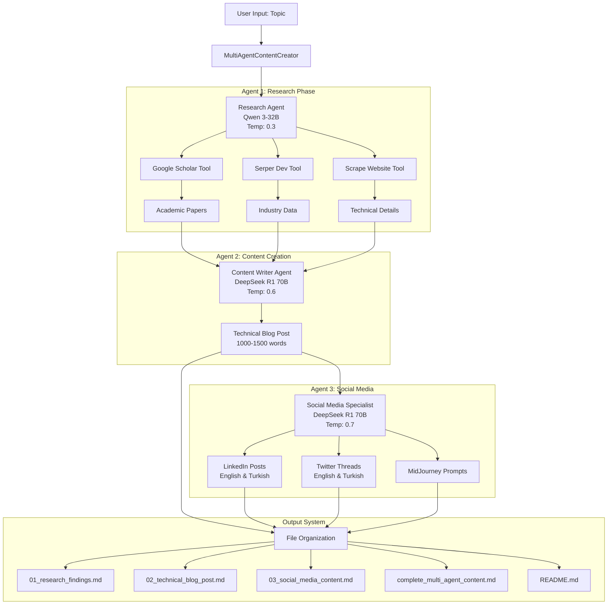
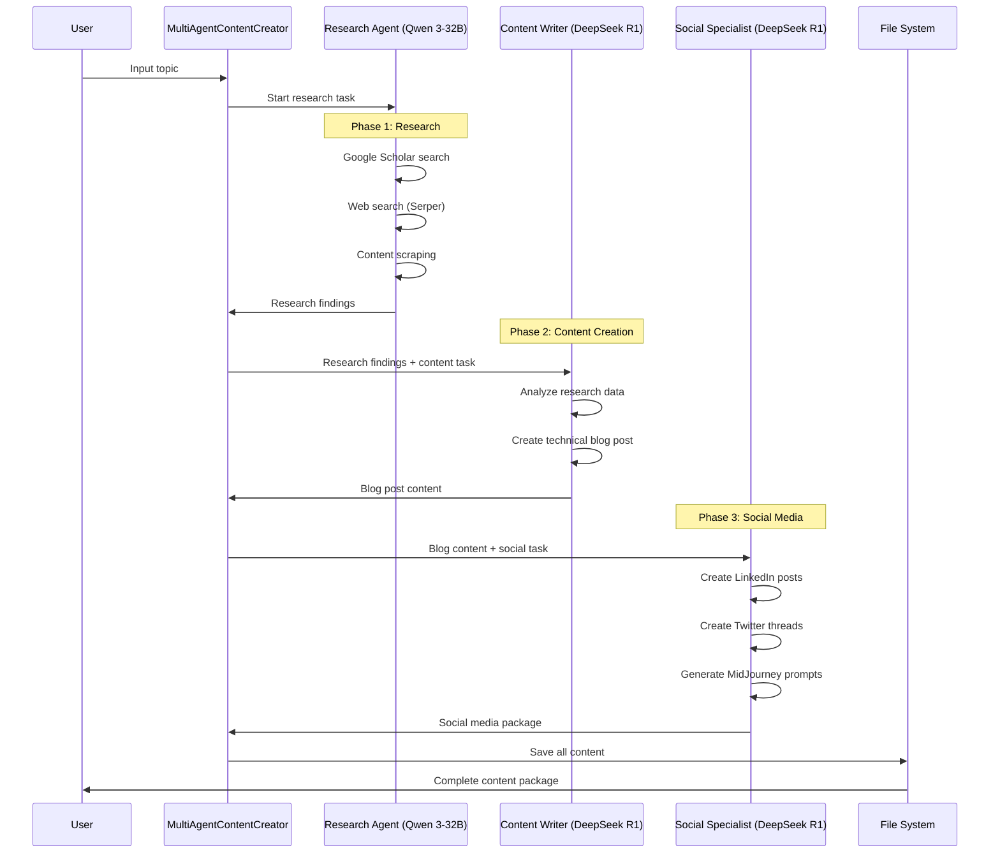
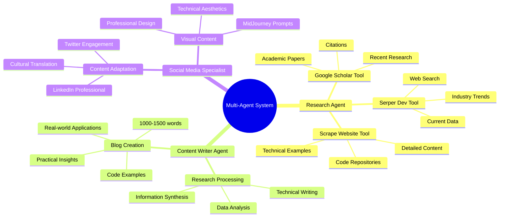
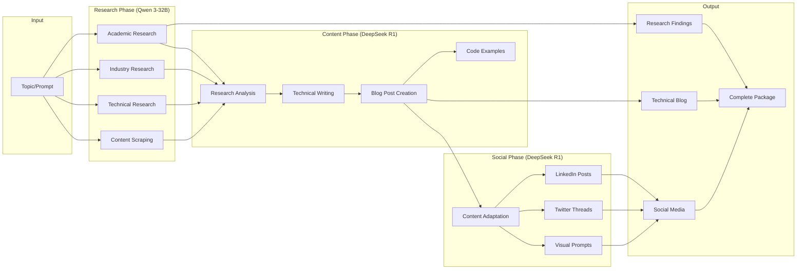

# Multi-Agent Architecture: ResearcherKilo.py

## System Overview

The new `researcherkilo.py` implements a **3-Agent Specialized System** with different LLMs optimized for specific tasks:

- **Research Agent**: Qwen 3-32B (Fast, efficient research)
- **Content Writer**: DeepSeek R1 Distill Llama 70B (Creative, comprehensive writing)
- **Social Media Specialist**: DeepSeek R1 Distill Llama 70B (Engaging social content)

## Multi-Agent Architecture Diagram



## Sequential Workflow Process



## Agent Specialization Matrix

| Agent | LLM Model | Temperature | Max Tokens | Primary Function | Tools |
|-------|-----------|-------------|------------|------------------|-------|
| **Research Agent** | Qwen 3-32B | 0.3 (Focused) | 3000 | Data gathering, fact-finding | Scholar, Serper, Scraper |
| **Content Writer** | DeepSeek R1 70B | 0.6 (Balanced) | 4000 | Technical writing, blog creation | None (uses research) |
| **Social Specialist** | DeepSeek R1 70B | 0.7 (Creative) | 2000 | Social content, engagement | None (uses blog content) |

## Tool Distribution Architecture



## Data Flow Architecture



## Key Improvements Over Single-Agent System

### 1. **Specialized LLM Selection**
- **Qwen 3-32B**: Optimized for research tasks (faster, more efficient)
- **DeepSeek R1**: Optimized for creative writing and social content

### 2. **Task-Specific Optimization**
- **Research**: Lower temperature (0.3) for focused, factual gathering
- **Content**: Medium temperature (0.6) for balanced creativity
- **Social**: Higher temperature (0.7) for engaging content

### 3. **Sequential Processing**
- Research findings feed into content creation
- Blog content feeds into social media adaptation
- Each agent builds upon previous work

### 4. **Enhanced Output Structure**
- Separate files for each agent's output
- Complete package combining all results
- Detailed README with architecture information

## File Output Structure

```
multi_agent_content/
├── 01_research_findings.md      # Research Agent output
├── 02_technical_blog_post.md    # Content Writer output  
├── 03_social_media_content.md   # Social Specialist output
├── complete_multi_agent_content.md  # Combined output
└── README.md                    # Architecture & usage info
```

## Performance Benefits

1. **Efficiency**: Qwen 3-32B handles research faster than DeepSeek R1
2. **Quality**: DeepSeek R1 provides superior creative writing
3. **Specialization**: Each agent optimized for specific tasks
4. **Scalability**: Easy to add more specialized agents
5. **Cost Optimization**: Use appropriate model for each task

This multi-agent architecture provides better specialization, improved efficiency, and higher quality output compared to the single-agent approach.